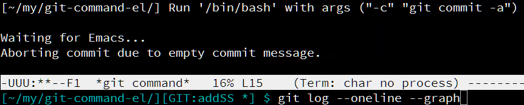

git-command.el
===============

Yet another Git interface.

This packgage provides a way to invoke Git shell command using minibuffer.
There is no major-mode nor minor-mode, you just have to remember usual Git
subcommands and options.

This package provides only one user command: type

    M-x RET git-command

to input Git shell command to minibuffer that you want to invoke.
Before runnning git command `$GIT_EDITOR` and `$GIT_PAGER` are set nicely so
that you can seamlessly edit files or get pager outputs with Emacs you are
currently working on.

Optionally, you can give prefix argument to create a new buffer for that git
invocation.

Completion
-----------

It is highly recommended to Install [`pcmpl-git`](http://melpa.org/#/pcmpl-git)
with this package.
That enables completion when entering git command interactively.

License
--------

This software is unlicensed. For details, see `LICENSE`.
